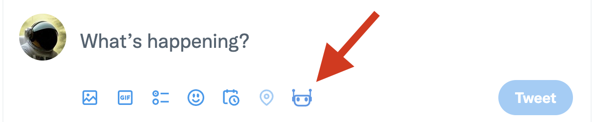
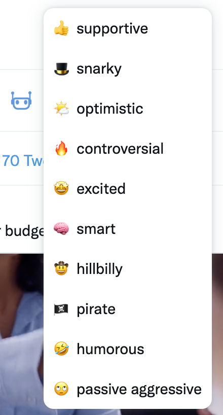
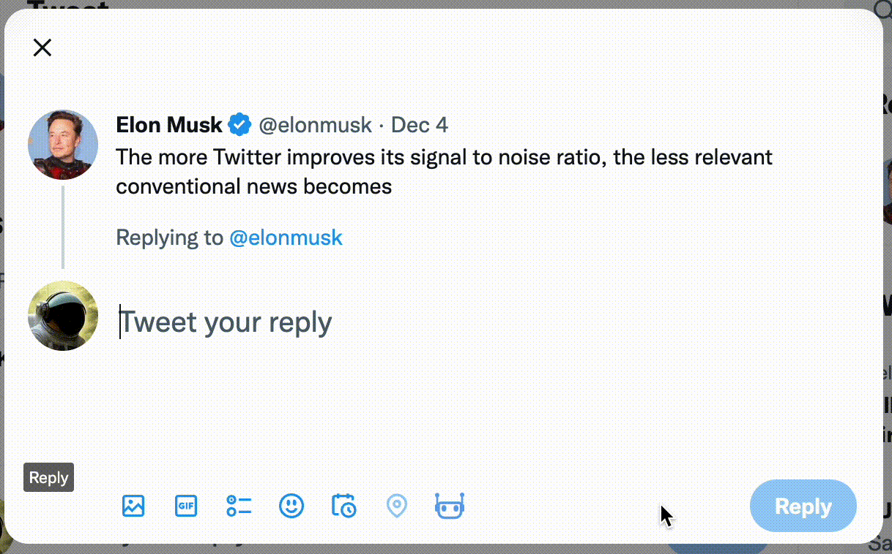

# tweetGPT Chrome Extension

## Requirements
To use this extension, will you need:
* Twitter account
* OpenAI account
* Chrome browser

## Installation from Chrome Web Store
1. Open the [extension page](https://chrome.google.com/webstore/detail/tweetgpt/lkjblpoingopdeaofcaapmeoojjjnhnc) in Chrome Web Store.
2. Press "Add to Chrome" button
## Manual installation
1. Clone this repo to your machine
2. Open [chrome://extensions/](chrome://extensions/) in your browser
3. Check the box for Developer mode in the top right
4. Press __Load Unpacked__ button and select the folder with the code

You can start using the extension now.

## How to use tweetGPT
When you open a new tab with Twitter, you will see this icon under the tweet section:

When you press it, it will let you select a type of tweet to generate. The types include positive, negative, controversial, etc. 

Once selected, the extension will write a new tweet.

For a reply, it will generate a tweet based on the original tweet. For a new tweet, it will write a tweet based on what's trending right now.

## ⚠️ Warning
Depending on the tweet type, TweetGPT can sometimes generate controversial or even offensive tweets.
Remember, this is like an L2 autopilot - the driver is responsible for the outcome. Don't tweet what you disagree with, just re-generate the tweet instead.

## Feedback
If you have feedback, please create an issue in the repository or simply send me a DM in Twitter: [@512x512](https://twitter.com/512x512)
